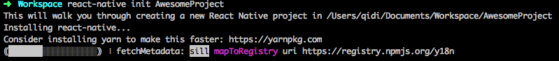
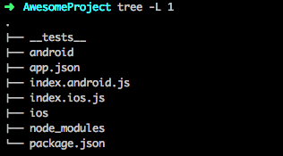

&emsp;&emsp;目前React Native(以下简称RN)在我们公司的线上产品中已经大规模使用了，在这个过程中我们踩了不少的坑，也解决了许多棘手的问题。RN项目实战是一个系列文章，主要分享我们是如何把RN框架一步一步落地应用到我们的实际业务场景，本文是系列文章的第一篇，主要介绍如何把RN框架集成到现有项目中。

## iOS篇

### 开发环境准备

&emsp;&emsp;使用RN之前，需要安装搭建必要的开发工具和环境，主要包括 Node, Watchman, React Native命令行工具，CocoaPods等，安装方法如下：

- brew install node
- brew install watchman
- npm install -g react-native-cli
- gem install cocoapods

以上分别是安装Node、watchman、React Native命令行工具和CocoaPods的命令，安装过程中如果提示权限不够，在对应的命令前加上sudo即可。

如果搭建环境过程中出现问题，可以看一下参考目录中的第一篇文章。

### 初识RN

1. 创建项目

&emsp;&emsp;RN项目创建比较简单，执行执行 ***react-native init <项目名字>*** 即可。

2. 工程目录结构

&emsp;&emsp;

&emsp;&emsp;

3. RN项目运行

### 集成RN框架到现有项目中

### 开发、调试
1. IDE选择
2. 调试
3. Hot load
4. ATS对local server的影响

&emsp;&emsp;正文正文正文正文正文正文正文正文正文正文正文正文正文正文正文正文正文正文正文正文正文正文正文正文正文正文正文正文正文正文正文正文正文正文正文正文正文正文正文正文正文正文正文正文

&emsp;&emsp;正文正文正文正文正文正文正文正文正文正文正文:
- 项目1
- 项目2
- 项目3

## Android篇

## 参考目录
- [React Native 环境搭建和创建项目](http://www.jianshu.com/p/a85cba2efb7a)
