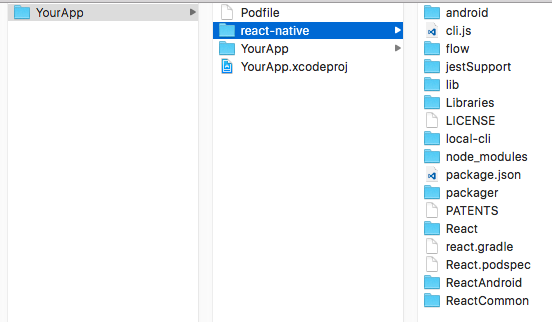
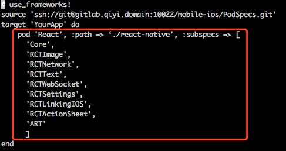
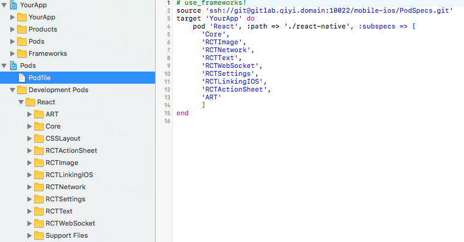
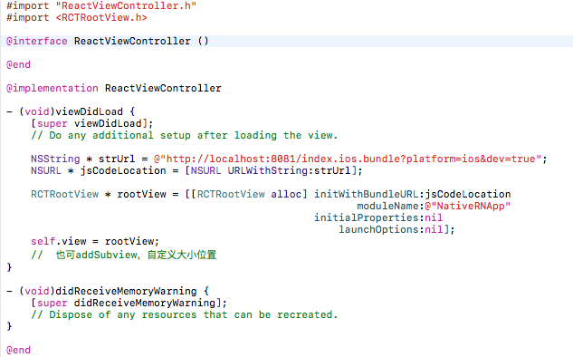

&emsp;&emsp;目前React Native(以下简称RN)在我们公司的线上产品中已经大规模使用了，在这个过程中我们踩了不少的坑，也解决了许多棘手的问题。RN项目实战是一个系列文章，主要分享我们是如何把RN框架一步一步落地应用到我们的实际业务场景，本文是系列文章的第一篇，主要介绍如何把RN框架集成到现有项目中。

## iOS篇

### 开发环境准备

&emsp;&emsp;使用RN之前，需要安装搭建必要的开发工具和环境，主要包括 Node, Watchman, React Native命令行工具，CocoaPods等，安装方法如下：

- brew install node
- brew install watchman
- npm install -g react-native-cli
- gem install cocoapods

以上分别是安装Node、watchman、React Native命令行工具和CocoaPods的命令，安装过程中如果提示权限不够，在对应的命令前加上sudo即可。

如果搭建环境过程中出现问题，可以看一下参考目录中的第一篇文章。

### 初识RN

1. 创建项目

&emsp;&emsp;RN项目创建比较简单，执行 ***react-native init <项目名字>*** 即可。

2. 工程目录结构

&emsp;&emsp;RN工程的目录结构如下：

- android 和 ios 目录分包是安卓和iOS原生工程项目文件夹，其实本质上就是自动生成的测试工程，如果你需要把RN框架集成到原生项目中，可以不用关心这两个目录。
- index.android.js 是RN工程JS部分对应Android的入口
- index.ios.js 是RN工程JS部分对应iOS的入口 
- node_modules 是当前工程中所有的依赖包
- package.json 如下图，package.json描述了当前工程的依赖配置，可以修改这个文件增加、删除某个依赖库，然后使用npm install命令更新依赖包

3. RN项目运行
- 运行npm install命令，更新工程依赖库
- 运行npm start命令，打包JS Bundle，启动本地服务器
- 运行工程目录中iOS或Android的测试工程

### 集成RN框架到现有项目中

上面介绍了怎么搭建开发环境，创建并运行了第一个RN工程，但实际项目应用中，通常是原生和RN混合使用：也就是某些页面或业务场景会使用RN开发，其他的页面继续用原生或者H5的方式开发。

把RN框架集成到你现有的项目中比较简单，粗暴一点的方法是直接把RN框架源码拖到你的工程中，但是这样不方便模块化管理，后续需要扩展或升级RN框架都不方便，所以我们是通过Pod的方式集成RN框架的。

RN框架的源码在工程目录中node_modules下react-native文件中，可以把这个文件直接拷贝到你的工程目录中，如下图：

RN框架本身也是也是使用Pods管理的，react-native目录下有一个React.podspec文件，里面定义了RN框架各模块的subspec，可以直接在你工程的Podfile中直接引用。

pod install以后，就可以把RN框架集成到你的工程了。

RN框架集成成功后，就可以在你的项目中使用RN了，iOS平台上RN最终会渲染到RCTRootView，所以向对应ViewController 添加RCTRootView就可以展现RN页面了。

## Android篇

## 参考目录
- [React Native 环境搭建和创建项目](http://www.jianshu.com/p/a85cba2efb7a)
