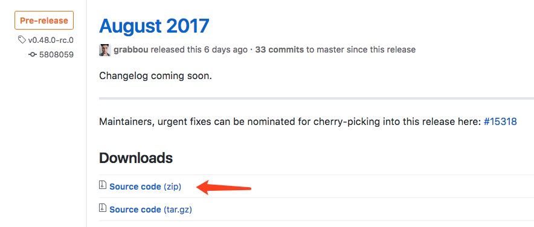
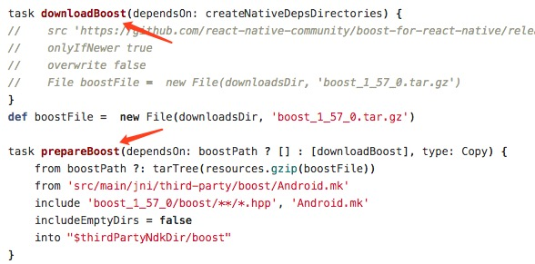
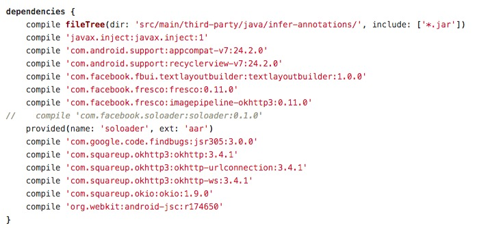

&emsp;&emsp;目前React Native(以下简称RN)在我们公司的线上产品中已经大规模使用了，在这个过程中我们踩了不少的坑，也解决了许多棘手的问题。RN项目实战是一个系列文章，主要分享我们是如何把RN框架一步一步落地应用到我们的实际业务场景，本文是系列文章的第一篇，主要介绍如何把RN框架集成到现有项目中。

## iOS篇

### 开发环境准备

&emsp;&emsp;使用RN之前，需要安装搭建必要的开发工具和环境，主要包括 Node, Watchman, React Native命令行工具，CocoaPods等，安装方法如下：

- brew install node
- brew install watchman
- npm install -g react-native-cli
- gem install cocoapods

以上分别是安装Node、watchman、React Native命令行工具和CocoaPods的命令，安装过程中如果提示权限不够，在对应的命令前加上sudo即可。

如果搭建环境过程中出现问题，可以看一下参考目录中的第一篇文章。

### 初识RN

1. 创建项目

&emsp;&emsp;RN项目创建比较简单，执行 ***react-native init <项目名字>*** 即可。

2. 工程目录结构

&emsp;&emsp;RN工程的目录结构如下：

- android 和 ios 目录分包是安卓和iOS原生工程项目文件夹，其实本质上就是自动生成的测试工程，如果你需要把RN框架集成到原生项目中，可以不用关心这两个目录。
- index.android.js 是RN工程JS部分对应Android的入口
- index.ios.js 是RN工程JS部分对应iOS的入口 
- node_modules 是当前工程中所有的依赖包
- package.json 如下图，package.json描述了当前工程的依赖配置，可以修改这个文件增加、删除某个依赖库，然后使用npm install命令更新依赖包

3. RN项目运行
- 运行npm install命令，更新工程依赖库
- 运行npm start命令，打包JS Bundle，启动本地服务器
- 运行工程目录中iOS或Android的测试工程

### 集成RN框架到现有项目中

上面介绍了怎么搭建开发环境，创建并运行了第一个RN工程，但实际项目应用中，通常是原生和RN混合使用：也就是某些页面或业务场景会使用RN开发，其他的页面继续用原生或者H5的方式开发。

把RN框架集成到你现有的项目中比较简单，粗暴一点的方法是直接把RN框架源码拖到你的工程中，但是这样不方便模块化管理，后续需要扩展或升级RN框架都不方便，所以我们是通过Pod的方式集成RN框架的。

RN框架的源码在工程目录中node_modules下react-native文件中，可以把这个文件直接拷贝到你的工程目录中，如下图：

RN框架本身也是使用Pods管理的，react-native目录下有一个React.podspec文件，里面定义了RN框架各模块的subspec，可以直接在你工程的Podfile中直接引用。

pod install以后，就可以把RN框架集成到你的工程了。

RN框架集成成功后，就可以在你的项目中使用RN了，iOS平台上RN最终会渲染到RCTRootView，所以向对应ViewController 添加RCTRootView就可以展现RN页面了。

## Android篇

相比于iOS平台，Android平台的集成要复杂一些。主要原因在于React Native For Android本身依赖了大量第三方的库，比如fresco, okhttp等。因此，对于一些已经有一定规模的工程，想要集成React Native框架，只能手工去一个个检查，对齐并补全相关的依赖库了。

### 源码获取

首先，从工程角度，直接依赖线上的包会带来一些的不可预计的问题。因此，我们的第一步自然就是获取RN的源码，并从本地的源码打包。

- 从react native的github地址选取稳定版本的[release](https://github.com/facebook/react-native/releases)，在release note的底部有下载源码的链接。通常来说，最新的版本越稳定，接口特性越丰富，性能表现也越优异。  

- 解开压缩包后，会看到ReactCommon和ReactAndroid文件夹，以及编译相关的gradle文件。其他的文件基本与Android打包没太大关系，可以考虑删除。

### ndk处理

RN的ndk部分，依赖了一些常见的库，需要进行适当修改，以防止冲突。同时，我们可以通过一些简单的处理，来解决翻墙问题并大幅提高打包速度。

- 查看ReactAndroid/build.gradle文件。里面有一堆so相关的task。这些task通常分为download和prepare两步，具体如下图所示：  

- 针对download的task，可以手动下载这些task里所指定的lib。目前包括boost, jsc, double-conversion, folly和glog。有些下载的网址链接网速很慢甚至根本访问不到，这时候就可以靠国内镜像或者百度来解决了。

- 然后，将这些lib放到ReactAndroid/build/downloads路径下（配置文件中默认的ndk打包路径，可以修改配置参数），就可以注释掉build.gradle中的download相关task，只留下prepare的部分了。再备份一下这些so库，这样即使不小心clean了以后，也能迅速开始打包，无需重新下载了。

- 处理完这些，就可以使用RN指定的ndk版本进行打包了。(ndk的兼容性一直堪忧，请务必使用rn官方说明的ndk版本，并不是越新越好的)  

特别要注意的是，rn默认打包出来的so分别为armeabi-v7a和x86。如果你的app不是armeabi-v7a的，则不能直接使用，而x86大部分也是多余的。该怎么处理会在后面介绍到。

### 处理Java依赖

Java部分的代码主要集中在ReactAndroid文件夹内，尤其是所有的gradle脚本。这就是要重点关心的地方了，改动量也会大一些。0.41版本的依赖关系如下（最新的版本可能某些库有更新）：  

   

通常情况下，应该是升级或者降级主App的依赖版本来对齐RN的依赖，这样子就可以不改动RN的源码。但是对于某些结构不好的工程，改动主App来适应RN有着不可估计的工作量，因此只好改动RN源码。无论如何适配，主要关注的点如下：

- 网络问题。。。老样子，并不是任何地方的网络在任何时间都是通畅的。还是下载下来，然后从在线依赖改为本地依赖吧。
- 接口不一致问题。。。比如fresco的版本，不同的版本接口就可能会不一致。再比如okhttp3，直接把okhttp2的名字都换了。
- 包本身的问题。。。okhttp3在一开始版本中没有包含okhttp-ws，后来则包含了。

### 依赖替换
在分析了公司的主App的依赖情况后，可以简单的把依赖分为两个部分。一部分是主App还没有依赖的，还有一部分是已经依赖过的。具体的处理方式如下：
1. 对于inject, soloader, jackson-core, jsr, jsc这些没有依赖过的库，下载网络上的公共版本即可。由于soloader和jsc是aar包，且没有资源文件。因此将其解压缩，拆包，分别将jar和so放入libs中，这样比较省事。
2. 对于support-v7,recyclerview-v7,fresco, imagepipeline, okhttp, okhttp-urlconnection, okio, okhttp-ws这些已经依赖了的，则要替换所有的依赖关系为主App提供的本地依赖。

rn框架最终运行是在主App的环境中，因此在打包框架前就使用主App的依赖，可以及早发现兼容性问题。一张改过后的图大致如下，仅供参考，实际集成需要根据自身情况来：  

### 打包集成
经过了这么一系列的预处理，终于可以进行框架打包了。具体的操作步骤如下：
1. 根据官方的说明，在ReactAndroid工程目录下运行gradlew build。这是一个普通的android工程打包过程。
2. 来到build文件下，在最终的output目录中找到ReactAndroid-release.aar。
3. 公司的主App的so全部都放在了armeabi目录下，因此与RN的so路径有所冲突，需要处理。简单粗暴的做法是
    - 把aar解压到文件夹。
    - 把其中的armeabi-v7a这个目录重新命名为armeabi。
    - 删除多余的x86目录。
    - 把文件夹重新压缩，并把后缀由zip改为aar。
4. 在主App中建立一个名为React的工程，并让主App依赖此工程。
5. 在此工程中放入刚才得到的rn框架的aar包并配置好依赖，并将所有不存在的依赖全部加入这个工程中。以我司为例，就是把inject, soloader, jackson-core, jsr, jsc这些原本不存在的依赖全部加入并在build.gradle中配置好依赖。

到此，主App集成Android RN框架的工作就全部完成了。主App已经具备了运行RN的能力了。

## 参考目录
- [React Native 环境搭建和创建项目](http://www.jianshu.com/p/a85cba2efb7a)
