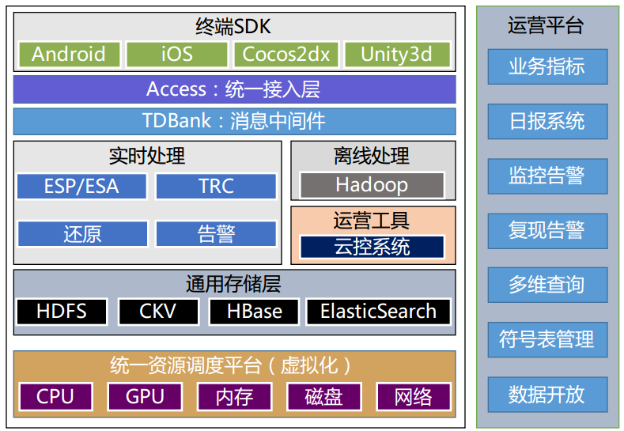
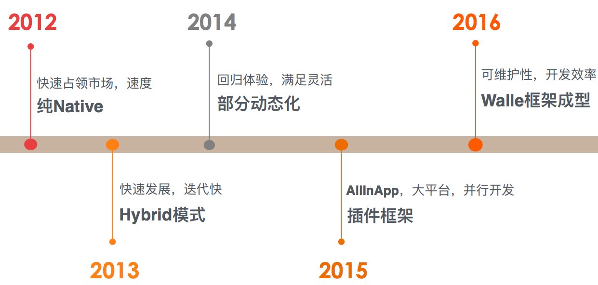
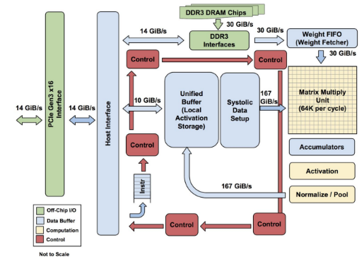

### [关于如何准备一场演讲的清单](http://mp.weixin.qq.com/s/vExnnBm3rPp-8iapjt5cFw)

我们码农工作到一定年限后，职业发展高度其实是取决于沟通、影响力、统筹规划能力等很多软实力；演讲是提升个人影响力的很好方式，国内现在类似QCon，GMTC等大大小小的技术会议和沙龙有很多。那么怎么做好一场演讲呢，罗辑思维这篇文章有些点还是挺有借鉴意义的：

- 演讲切忌不做准备。以“今天我没有特别准备，随便说说，大家多包涵”开场，并不能表达谦虚，只会让听众感到不受尊重。
- 演讲最好是单层逻辑，切忌“三小点，下面还有五个分论点”。太多的层次，会加重听众的认知负担。
- 好的结尾，是全篇的点睛和复盘。结尾处务必进行一次总结：直接告诉听众，今天演讲的目的是什么。
- 所有的肢体语言都应该是有意识的，而不是慌张、无意识的乱动。有些习惯性动作，比如不自觉的挠头、摸鼻子、抖腿等，自己在平时很难注意到，但在台上就会被看得一清二楚，要在练习的时候去掉。
- 演讲的时候，眼神要环视和点视交替使用。环视，即环视全场；点视，即盯着某个人或者某个点看。如果现场观众人数较少，建议与每个听众都有5秒钟的眼神交流。好的演讲者，会让听众感觉就算在数百数千人的场景中，演讲者都是在面对面和自己讲话。
- 演讲超时是不礼貌的，会打乱整场活动的议程。控制演讲时长，是在演讲准备之初就要做好的功课。总共时长多少，哪块可以快速略过，哪块需要娓娓道来，提前做好时间分配。

### [腾讯移动分析Crash系统实时化建设与实践](http://ppt.geekbang.org/slide/show/874)

实时Crash分析系统是很重要的开发、运营基础设施，腾讯的这个分享非常赞，干货满满，非常值得反复研究。作者从 ***行业现状与挑战、腾讯移动分析解决方案、终端全平台建设、实时与运营系统建设*** 四个方面详细介绍了如何构建一个实时Crash分析系统。

现在移动App的质量情况：
- 用户遇到Crash的比例: 60%+
- 首次启动Crash，选择立即卸载的比例: 20%+
- 使用过程中，Crash后用户给应用打差评的比例: 70%+

构建实时Crash分析系统的挑战：
- 多平台覆盖: Android、iOS、游戏引擎
- 海量实时处理: 亿级日流量、实时还原、实时计算、实时告警
- 智能合并检索: 堆栈提取、智能合并、多维检索

看一下解决方案的总体架构

需要解决的问题:
- 不同平台和CPU架构环境下异常数据、堆栈、环境属性、运行参数等数据的完整获取
- 将异常数据实时化处理，第一时间展现给用户，了解产品质量
- 准确的异常追踪过程，精确到行号的堆栈还原，是还原Crash现场的有力数据
- 完备的监控告警机制能及时监控App质量的波动，把握质量情况；云控助力远程解决问题

PPT中还介绍了 ***终端Crash采集平台建设的细节，包括Android C/C++ Crash处理流程、C/C++ Crash捕获流程、多维度数据采集辅助快速定位异常问题、实时还原系统建设(符号还原、行号还原、特征堆栈提取、实时多维度检索)、秒级实时计算系统、单价性能优化--海量并发连接、实时监控告警、云控系统*** ，更多细节请点击下方的“阅读原文”获取本文的带链接版本，然后通看完整的PPT。

一行代码，一个系统;腾讯推出的[腾讯移动分析](http://mta.qq.com/mta/)系统已近包含上面所有功能，开发者很容易就可以接入。

### [58同城Android客户端框架演进与实践](http://ppt.geekbang.org/slide/show/855)

作者分享了58同城Android客户端的架构演进过程，从最开始的纯Native到Hybrid，再到动态化、插件化、组件化。每一次改变都是源于实际的需求，比如从Native到Hybrid时为了解决开发效率问题，保证业务快速迭代，同时能快速修复线上问题、动态化是为了满足产品动态运营的需求、插件化和组件化是为了保证各个业务线并行开发以及各个业务单元的动态升级能力。通过这个PPT也可以快速的了解大型Android App的架构标配，更多细节可以看完整的PPT。

### [iOS Crash拦截方案](https://github.com/chenfanfang/AvoidCrash)

一个已经发布到AppStore上的App，最忌讳的就是崩溃问题。为什么在开发阶段或者测试阶段都不会崩溃，而发布到AppStore上就崩溃了呢？究其根源，最主要的原因就是数据的错乱。特别是服务器返回数据的错乱，将严重影响到我们的App。
这个方案利用runtime技术对一些常用并且容易导致崩溃的方法进行处理，可以有效的防止崩溃。

目前已经支持对KVC赋值、NSAttributedString、NSMutableAttributedString、NSMutableString、NSString、NSMutableDictionary、NSDictionary、NSMutableArray、NSArray等场景类崩溃的拦截。

### [提高驾驶技术：用GAN去除(爱情)动作片中的马赛克和衣服](https://zhuanlan.zhihu.com/p/27199954)

本文中作者给小伙伴们发了两个大福利，教会了大家看动作片的新姿势：
- 去除(爱情)动作片中的马赛克
- 给(爱情)动作片中的女孩穿(tuo)衣服

先直接看一下效果，再贴各种理论知识。

去马赛克

穿衣服

文中介绍了具体怎么实现去马赛克和穿衣服的相关背景知识，包括生成式模型、SRGAN、pix2pix、PatchGAN、对偶学习，有兴趣的童鞋可以请点击下方的“阅读原文”获取本文的带链接版本。

### [The neural network zoo](http://www.asimovinstitute.org/neural-network-zoo/)

神经网络最近火的一塌糊涂，各种架构的神经网络层出不穷，同时也涌现了大量缩写名词：DCIGN，BiLSTM，DCGAN，让人感觉有点懵逼。因此作者总结盘点各种架构的神经网络，如下图：

图中很清楚地展示了各种神经网络的架构以及他们的组成元素，但是这个架构图并不能展示每种神经网络的工作方式，也不一定涵盖了所有的类型的神经网络。以下是常见神经网络的简单介绍，完整的介绍请看原文。

前馈神经网络(FF)和感知器(P)

前馈神经网络是一种最简单的神经网络，各神经元分层排列。每个神经元只与前一层的神经元相连。接收前一层的输出，并输出给下一层，直至输出层。其中第一层称为输入层。最后一层为输出层．中间为隐含层，简称隐层。隐层可以是一层。也可以是多层。整个网络中无反馈，可用一个有向无环图表示。

反向传播算法可用来学习这个前馈神经网络的权值，采用梯度下降方法试图最小化网络输出值和目标值之间的误差平方。

具体细节可以参考 Rosenblatt, Frank的论文[ The perceptron: a probabilistic model for information storage and organization in the brain ](http://www.ling.upenn.edu/courses/cogs501/Rosenblatt1958.pdf)

卷积神经网络（CNN：convolutional neural networks）

卷积神经网络是一种前馈神经网络，对于大型图像处理有出色表现。20世纪60年代，Hubel和Wiesel在研究猫脑皮层中用于局部敏感和方向选择的神经元时发现其独特的网络结构可以有效地降低反馈神经网络的复杂性，继而提出了卷积神经网络。卷积神经网络由一个或多个卷积层和顶端的全连通层组成，同时也包括关联权重和池化层（pooling layer）。这一结构使得卷积神经网络能够利用输入数据的二维结构，主要用来识别位移、缩放及其他形式扭曲不变性的二维图形。

具体细节可以参考LeCun, Yann, et al的论文[ Gradient-based learning applied to document recognition ](http://yann.lecun.com/exdb/publis/pdf/lecun-98.pdf)

递归神经网络（RNN：Recurrent neural networks）

递归神经网络（RNN）是两种人工神经网络的总称。一种是时间递归神经网络（recurrent neural network），另一种是结构递归神经网络（recursive neural network）。时间递归神经网络的神经元间连接构成有向图，而结构递归神经网络利用相似的神经网络结构递归构造更为复杂的深度网络。RNN一般指代时间递归神经网络。单纯递归神经网络因为无法处理随着递归，权重指数级爆炸或消失的问题（Vanishing gradient problem），难以捕捉长期时间关联；而结合不同的LSTM可以很好解决这个问题

具体细节可以参考Elman, Jeffrey L.的论文[ Finding structure in time ](https://crl.ucsd.edu/~elman/Papers/fsit.pdf)

### [谷歌发布TPU研究论文，神经网络专用处理器是怎样炼成的？](https://zhuanlan.zhihu.com/p/26198901)

搜索、街景、照片、翻译，这些Google提供的服务，都使用了Google的TPU（张量处理器）来加速背后的神经网络计算。去年Google推出TPU并在近期对这一芯片的性能和架构进行了详细的研究。简单的结论是：TPU与同期的CPU和GPU相比，可以提供15-30倍的性能提升，以及30-80倍的效率（性能/瓦特）提升。这意味着，Google的服务既可以大规模运行于最先进的神经网络，而且可以把成本控制在可接受的程度上。以下的内容，将深入解读Google TPU中的技术，并且讨论如何实现更为出色的性能。

矩阵乘法是训练一个神经网络计算量最大的部分，实际业务中需要多少次乘法运算？2016年7月，Google团队调查了实际业务中，六个有代表性的神经网络应用，每个神经网络中的权重数量从500万到1亿不等。每一个预测，都需要许多步的输入数据和权重矩阵相乘，并输入到激活函数中。总而言之，计算量超大。作为优化的第一步，Google应用了一种称为量化的技术进行整数运算，而不是在CPU或者GPU上对所有数学工作进行32位或者16位浮点运算。这能减少所需的内存容量和计算资源。

TPU的结构图如下：

TPU包括以下计算资源：
- 矩阵乘法单元(MUX)：65,536个8位乘法和加法单元，运行矩阵计算
- 统一缓冲(UB)：作为寄存器工作的24MB容量SRAM
- 激活单元(AU)：硬件连接的激活函数

TPU性能强劲的秘诀，是因为它专注于神经网络推断。这使得量化选择、CISC指令集、矩阵处理器和最小设计都成为可能。神经网络正推动计算模式的转变，Google预计未来几年中，TPU将成为快速、智能和价格实惠的重要芯片。