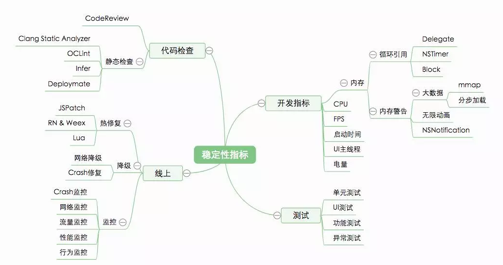
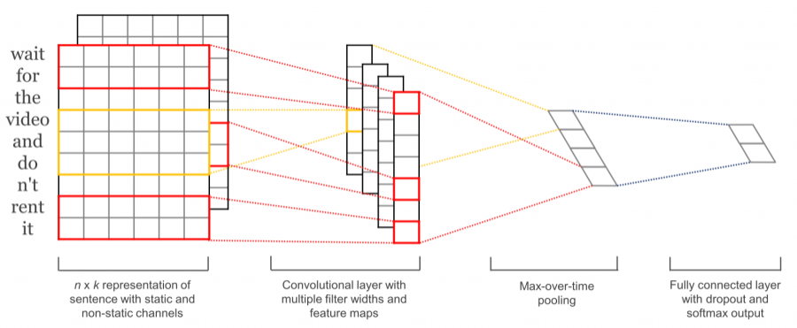
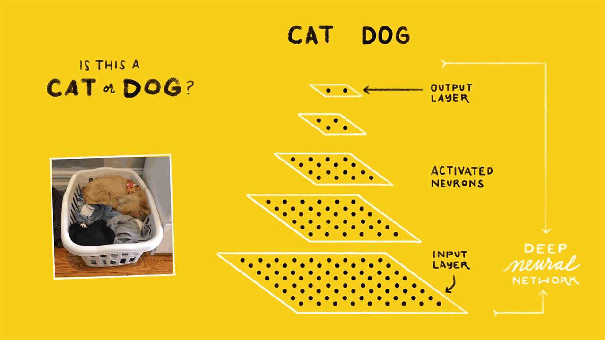
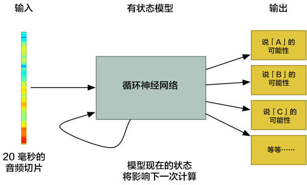

### [当你在浏览器中输入 google.com 并且按下回车之后发生了什么](https://github.com/skyline75489/what-happens-when-zh_CN)

这是一道古老的面试题：“当你在浏览器中输入 google.com 并且按下回车之后发生了什么？”。本文从一下几个角度展开了讨论，值得一看。

- 按下"g"键
- 回车键按下
- 产生中断[非USB键盘]
- (Windows)一个 WM_KEYDOWN 消息被发往应用程序
- (Mac OS X)一个 KeyDown NSEvent被发往应用程序
- (GNU/Linux)Xorg 服务器监听键码值
- 解析URL
- 输入的是 URL 还是搜索的关键字？
- 转换非 ASCII 的 Unicode 字符
- 检查 HSTS 列表
- DNS 查询
- ARP 过程
- 使用套接字
- TLS 握手
- HTTP 协议
- HTTP 服务器请求处理
- 浏览器背后的故事
- 浏览器
- HTML 解析
- CSS 解析
- 页面渲染
- GPU 渲染
- Window Server
- 后期渲染与用户引发的处理

## 移动开发

### [iOS App 稳定性指标及监测](http://mp.weixin.qq.com/s/gibRDdfkf7aL5-jUfqo7BA)

一个iOS App的稳定性，主要决定于整体的系统架构设计，同时也不可忽略编程的细节，正所谓“千里之堤，溃于蚁穴”，一旦考虑不周，看似无关紧要的代码片段可能会带来整体软件系统的崩溃。尤其因为苹果限制了热更新机制，App本身的稳定性及容错性就显的更加重要，之前可以通过发布热补丁的方式解决线上代码问题，现在就需要在提交之前对App开发周期内的各个指标进行实时监测，尽量让问题暴漏在开发阶段，然后及时修复，减少线上出问题的几率。针对一个App的开发周期，它的稳定性指标主要有以下几个环节构成：

本文从开发过程、静态分析过程、测试过程、发布以及线上监控几个角度分别介绍了内存使用监控及泄露、CPU使用率、FPS、启动时间等指标、UI的主线程监测、NSAssert断言、各种常见问题、静态检查工具等等，非常干货的一篇文章。

### [今日头条iOS客户端启动速度优化](https://techblog.toutiao.com/2017/01/17/iosspeed)

应用启动时间，直接影响用户对一款应用的判断和使用体验。头条主app本身就包含非常多并且复杂度高的业务模块（如新闻、视频等），也接入了很多第三方的插件，这势必会拖慢应用的启动时间，本着精益求精的态度和对用户体验的追求，我们希望在业务扩张的同时最大程度的优化启动时间。

### [美团点评移动网络优化实践](https://tech.meituan.com/SharkSDK.html)

网络优化对于App产品的用户体验至关重要，与公司的运营和营收息息相关。这里列举两个公开的数据：

- “页面加载超过3秒，57%的用户会离开。”
- “Amazon页面加载延长1秒，一年就会减少16亿美金营收。”

在做网络优化前，我们首先要为网络通信质量设立一个标尺。

在美团点评，监控团队开发了基于端到端的客户端监控平台。这里要先解释一下“端到端”的含义：是指请求从客户端发出到服务端响应返回的整个过程。它区别于后台服务监控，是一种从用户角度观察到的真实体验监控。

## 机器学习

### [深度学习动手入门：GitHub上四个超棒的TensorFlow开源项目](http://mp.weixin.qq.com/s/AIKHJSXL3KsgqSsqu6Wy1g)

TensorFlow是一个深度学习库，使用这一框架，可以用来构建和测试深度神经网络。深度学习让我们能够以极高的准确性构建复杂的应用程序。图像、视频、文本、音频等领域的问题，都可以通过深度学习解决。TensorFlow可以用于实现前述所有应用。

下面分享几个四个非常有意思的TensorFlow GitHub项目。

#### 项目一：[Neural Style](https://github.com/cysmith/neural-style-tf)

这是最酷的TensorFlow GitHub项目之一。神经风格是将一张照片的风格迁移到另一张照片上的过程，同时保留相关的特张。简单的来说，通过这个项目，你可以使用TensorFlow创建自己的Prisma应用程序。

#### 项目二：[Mozilla Deep Speech](https://github.com/mozilla/DeepSpeech)

这个GitHub项目使用TensorFlow将语音转换为文本。语音转文本是一个热门的机器学习领域，然而各地的人们有着不同的口音，这也是一个难以解决的问题。不过仍然可以通过深度学习实现非常不错的准确性。

其实这个项目，是一个基于百度DeepSpeech架构的TensorFlow实现。换句话说，这个项目是百度的内核，Google的外貌。

#### 项目三：[句子分类](https://github.com/dennybritz/cnn-text-classification-tf)

句子分类就是识别句子类型的过程。例如，对于“食物非常糟糕”这个句子，你可能希望将其分类为正面句子或负面句子，这也被称为情绪分析。这个问题的难点在于：句子结构带来的复杂性。

利用卷积神经网络，我们可以尝试构建一个强大的文本分类器。

#### 项目四：[图像分类/物体识别](https://github.com/akshaypai/tfClassifier)

图像分类，也就是训练系统识别猫猫狗狗，或者车道、海滩、天际线等场景。计算机视觉是一个范围巨大的领域，从面部识别到情感识别，甚至可以进行视觉气体泄漏检测。虽然实现流程各异，但底层系统是相通的。

所以作者创建了一个TensorFlow GitHub库，其中包括两个相互关联的部分。第一部分：能够识别1000个对象的TensorFlow图像分类器。第二部分：创建并训练一个全新的图像分类器。

### [如何用深度学习进行语音识别？](https://medium.com/@ageitgey/machine-learning-is-fun-part-6-how-to-do-speech-recognition-with-deep-learning-28293c162f7a)

语音识别明明已经出现几十年了，为何直到现在才成为主流呢？那是因为深度学习终于将语音识别在非受控环境下的准确度提高到了一个足以投入实用的程度。本文介绍了如何用深度学习进行语音识别：包括声波信号采样、声音数据预处理、通过傅里叶变换把复杂声波分解为简单的声波、然后从短声音识别字符。

