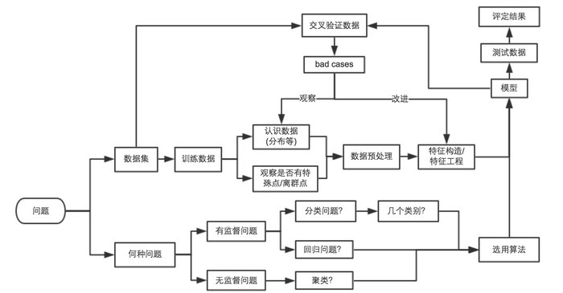

## 移动开发

### [Android微信智能心跳方案](https://mp.weixin.qq.com/s/ghnmC8709DvnhieQhkLJpA)

本文介绍了Android微信智能心跳方案，方案的主要目标是，在尽量不影响用户收消息及时性的前提下，根据网络类型自适应的找出保活信令TCP连接的尽可能大的心跳间隔，从而达到减少安卓微信因心跳引起的空中信道资源消耗，减少心跳Server的负载，以及减少部分因心跳引起的耗电。

### [高性能日志模块xlog](https://mp.weixin.qq.com/s/cnhuEodJGIbdodh0IxNeXQ)

对于移动开发者来说，最大的尴尬莫过于用户反馈程序出现问题，但因为不能重现且没有日志无法定位具体原因。这样看来客户端日志颇有点“养兵千日，用兵一时”的感觉，只有当出现问题且不容易重现时才能体现它的重要作用。为了保证关键时刻有日志可用，就需要保证程序整个生命周期内都要打日志，所以日志方案的选择至关重要。

### [动态界面：DSL&布局引擎](http://awhisper.github.io/2017/05/01/DSLandLayoutEngine/)

一篇文章读懂移动端界面动态化，包括了DSL、排版布局、渲染等等。

## 机器学习

### [ImageNet这八年：李飞飞和被她改变的AI世界](http://mp.weixin.qq.com/s/XfZpmw51oKqV4NlAQvvRxQ)

### [An end to end implementation of a Machine Learning pipeline](https://spandan-madan.github.io/DeepLearningProject/)

哈佛大学的一位助教写的一篇关于机器学习的入门文章，与别的文章不一样。作者是希望通过一个具体的实例介绍，手把手地教你怎么实现机器学习的Pipeline：怎么把一个现成的算法应用到你自己的数据集上？怎么获取数据集？怎么选择合适的算法？怎么评估你模型的效率？

文中介绍了一个基于视频帧和文本数据做电影分类的项目，主要有以下几个部分：

- 获取数据集 
- 数据预处理
- 非深度机器学习模型 : 概率与最大间隔分类器
- 深度学习背后的直观理论
- 可视化数据深度模型
- 文本深度模型
- 扩展与展望

详细请参考原文。

### [Kaggle入门，看这一篇就够了](https://zhuanlan.zhihu.com/p/25686876)

Kaggle成立于2010年，是一个进行数据发掘和预测竞赛的在线平台。从公司的角度来讲，可以提供一些数据，进而提出一个实际需要解决的问题；从参赛者的角度来讲，他们将组队参与项目，针对其中一个问题提出解决方案，最终由公司选出的最佳方案可以获得5K-10K美金的奖金。

Kaggle提供了一个非常好的学习平台，在这里你可以接触到真正的业界案例，收获实际的项目经验，在每一个项目中不断挑战自己，甚至在Kaggle榜上占据一席之位，提高自己在业内的知名度，优秀的排位甚至可能带来的非常好的工作机会。

### [逻辑回归应用之Kaggle泰坦尼克之灾](http://blog.csdn.net/han_xiaoyang/article/details/49797143)

Kaggle中的一个入门题，这篇文章手把手教你通过可视化分析数据集、特征工程、模型训练、模型融合等等，带你撸出一个baseline的模型，然后一步一步优化。

### [使用sklearn做单机特征工程](http://www.cnblogs.com/jasonfreak/p/5448385.html)

有这么一句话在业界广泛流传：数据和特征决定了机器学习的上限，而模型和算法只是逼近这个上限而已。那特征工程到底是什么呢？顾名思义，其本质是一项工程活动，目的是最大限度地从原始数据中提取特征以供算法和模型使用。

### [Kaggle 入门指南](https://zhuanlan.zhihu.com/p/25742261)

Top 5% 的老司机写的一个总结，包括了Kaggle比赛的大致流程、数据分析、数据可视化、统计测试、数据处理、特征工程、特征选择、模型选择、模型训练等。
