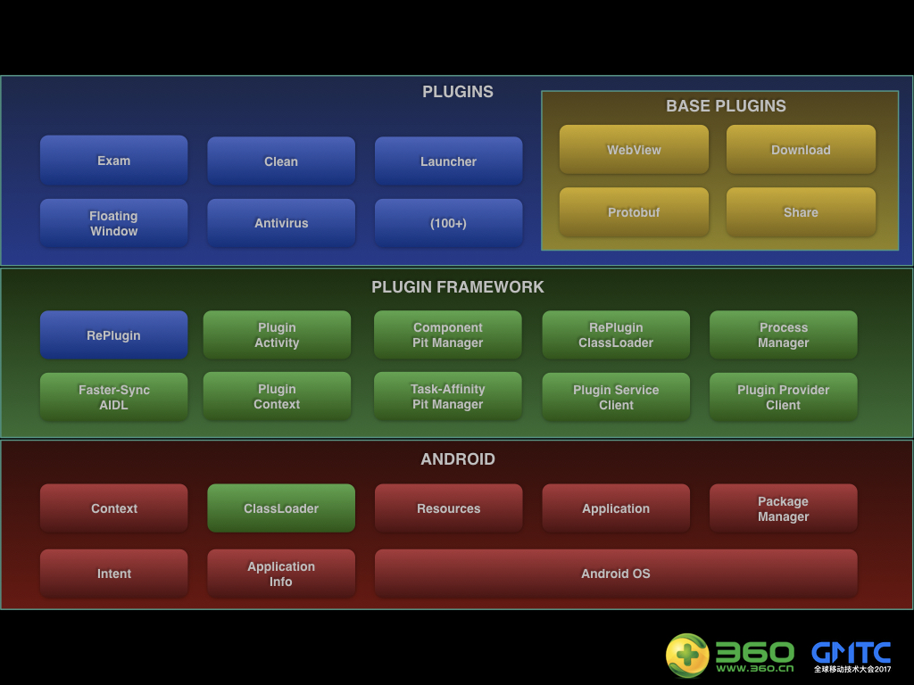
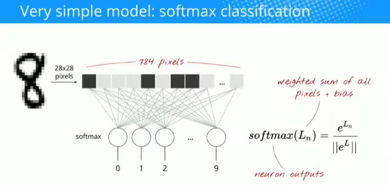
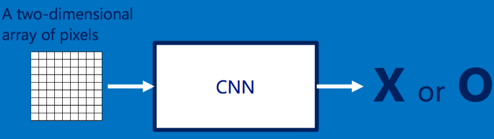

### [360开源RePlugin ，安卓进入“全面插件化”时代](https://github.com/Qihoo360/RePlugin/blob/master/README_CN.md)

RePlugin是一套完整的、稳定的、适合全面使用的，占坑类插件化方案，由360手机卫士的RePlugin Team研发，也是业内首个提出”全面插件化“（全面特性、全面兼容、全面使用）的方案。

其主要优势有：

- 极其灵活：主程序无需升级（无需在Manifest中预埋组件），即可支持新增的四大组件，甚至全新的插件
- 非常稳定：Hook点仅有一处（ClassLoader），无任何Binder Hook！如此可做到其崩溃率仅为“万分之一”，并完美兼容市面上近乎所有的Android ROM
- 特性丰富：支持近乎所有在“单品”开发时的特性。包括静态Receiver、Task-Affinity坑位、自定义Theme、进程坑位、AppCompat、DataBinding等
- 易于集成：无论插件还是主程序，只需“数行”就能完成接入
- 管理成熟：拥有成熟稳定的“插件管理方案”，支持插件安装、升级、卸载、版本管理，甚至包括进程通讯、协议版本、安全校验等
- 数亿支撑：有360手机卫士庞大的数亿用户做支撑，三年多的残酷验证，确保App用到的方案是最稳定、最适合使用的

### [滴滴开源Android端插件化框架VirtualAPK](https://mp.weixin.qq.com/s/GKQXqfCK6V-KOQZmhdxMdA)

6月30日滴滴正式宣布开源其 Android 插件化框架 —— VirtualAPK ，这也是滴滴公司的首个对外开源项目。

VirtualAPK 是滴滴出行自研的一款优秀的插件化框架，滴滴表示于去年开始研究 Android 插件化方面的技术，经过半年的开发、测试、适配和线上验证，最终形成了现在的 VirtualAPK 。VirtualAPK 已在滴滴内部得到了很好的验证，并已应用于滴滴乘客端和优步中国 APP 中。

### [百度公布AI生态全图：三天就能搞出无人车，要做AI时代的安卓](http://mp.weixin.qq.com/s/027pPG1CwH09PRja2NDu7Q)

首届百度AI开发者大会（Create 2017）今天在北京国家会议中心召开。期间，百度董事长兼CEO李彦宏、百度集团总裁兼COO陆奇等发布了DuerOS开放平台、Apollo开放平台等百度AI生态战略全图。

这是百度第一次，也是中国工业界，第一次大规模的AI开发者大会。整个社会正在进入一个全新的规模巨大的技术革命时代，AI时代已经到来，AI带来的机会还不均等。今天大会的目标，是让每个人都能参与这次振奋人心的革命时代。

### [没有博士学位如何玩转TensorFlow和深度学习](https://www.jiqizhixin.com/articles/9cb76fe4-99c1-47a7-84d2-63c35c90d313)

使用 TensorFlow，可以将深度机器学习从一个研究领域转变成一个主流的软件工程方法。文中的视频中演示了如何构建和训练一个用于识别手写数字的神经网络。在这个过程中，他将描述一些在神经网络设计中所使用的权衡技巧，最后他将使得其模型的识别准确度超过 99%。本教程的内容适用于各种水平的软件开发者。即使是经验丰富的机器学习爱好者，本视频也能通过卷积网络等已知的模型来带你了解 TensorFlow。这是一个技术密集的视频，是为想要快速上手机器学习的初学者而设计的。

作者以如何进行手写数字识别为例进行了详细地讲解。

### [深度 | 从入门到精通：卷积神经网络初学者指南](https://mp.weixin.qq.com/s/kvbDQ2d7iZ2cur2CQ_e-1Q)

卷积神经网络，听起来像是计算机科学、生物学和数学的诡异组合，但它们已经成为计算机视觉领域中最具影响力的革新的一部分。神经网络在 2012 年崭露头角，Alex Krizhevsky 凭借它们赢得了那一年的 ImageNet 挑战赛（大体上相当于计算机视觉的年度奥林匹克），他把分类误差记录从 26% 降到了 15%，在当时震惊了世界。自那之后，大量公司开始将深度学习用作服务的核心。Facebook 将神经网络用于自动标注算法、谷歌将它用于图片搜索、亚马逊将它用于商品推荐、Pinterest 将它用于个性化主页推送、Instagram 将它用于搜索架构。

然而，应用这些网络最经典最流行的案例是进行图像处理。本文详细介绍了如何使用卷积神经网络进行图像分类。

### [How CNNs Work](https://github.com/brohrer/public-hosting/raw/master/How_CNNs_work.pdf)

这是我看过的介绍卷积神经网络最通俗易懂的一个资料。作者通过一个简单的例子：识别一个图片是X还是O，介绍了卷积神经网络的方方面面。

