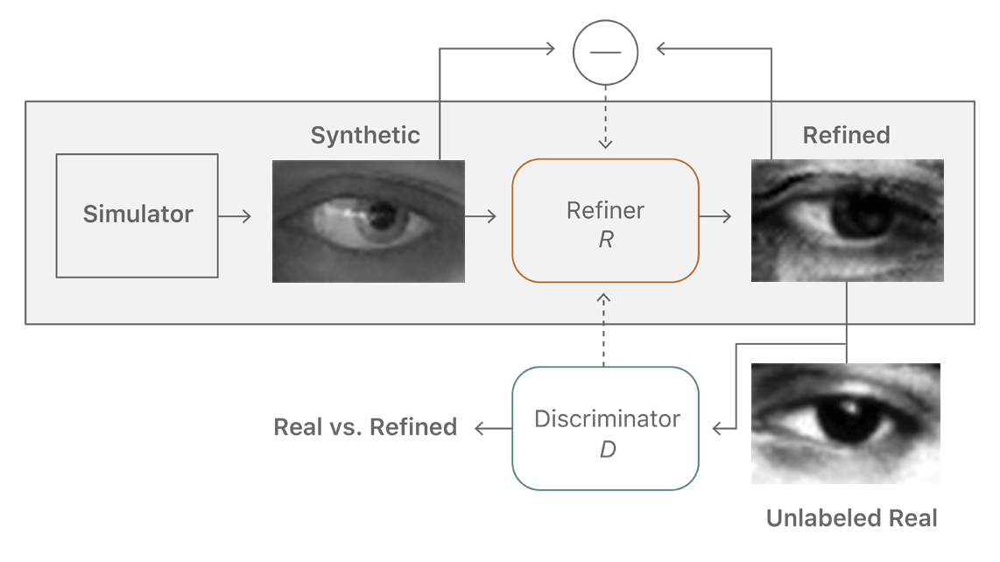

## 移动开发

### [WKWebView](https://blog.smallfan.net/2017/06/wkwebview/)

这篇文章首先从内存、加载速度等角度对比分析了WKWebView和UIWebView的表现，然后重点介绍了WKWebView的重要特性、常见的坑已经应对方案，非常不错的一篇文章。

### [Hybrid APP架构设计思路](http://itindex.net/detail/55039-hybrid-app-%E6%9E%B6%E6%9E%84)

这篇文章从通讯方式、界面与交互、H5离线访问、Native扩展、数据通道等角度阐述了Hybrid APP的架构设计思路。

### [浅谈 iOS Crash](http://mp.weixin.qq.com/s/_JKXwx0PTCy1sjE2fxy8Xg)

这篇文章介绍了Mach异常 和 Unix信号机制以及如何捕获iOS Crash、Crash日志内容分析、异常编码、异常类型、场景Crash分析等内容，个人觉得异常编码这部分内容很有价值，比如0xbaaaaaad指的是用户按住Home键和音量键，获取当前内存状态，不代表崩溃，0xc00010ff指的是cool off，因为太烫了被干掉等等。更多的异常编码请参考[维基百科](https://en.wikipedia.org/wiki/Hexspeak)

### [Tangram](http://tangram.pingguohe.net/docs/basic-concept/history)

天猫团队开源的跨平台模块化 UI 界面方案。 Tangram 不仅仅是一个 Native（iOS & Android）的界面开发框架，而是从日常工作中沉淀出的一套界面解决方案，涵盖了 Native SDK、GUI操作台、后端逻辑容器、组件库机制的一整套方案。

跨平台支持: 已有Android&iOS支持，一份数据，多端渲染一致

面向业务: 流式布局，瀑布流布局，吸顶，浮标，轮播，内置布局可适应大多数场景，开放的API，易于拓展自己的布局和解析器

高性能: 高效的回收复用算法，可定制化的复用粒，适应复杂布局的场景，为丝滑般顺畅提供基础

## 深度学习

### [Improving the Realism of Synthetic Images](https://machinelearning.apple.com/2017/07/07/GAN.html)

苹果官方开设了机器学习博客，读者在这里将会见到一些苹果工程师所写的博文。这是第一篇文章，讨论的是如何提升合成图像的逼真度，以便更好地对神经网络进行训练。有兴趣的点击原文看看吧。

### [用算法做服装设计：从30亿款女式衬衫中找出最受欢迎的9种](https://www.stitchfix.com/)

传统服装设计师的创意流程或许是从草图开始的，但Hybrid Designs却是从人工智能开始的。

算法生成设计的过程，是先由3套算法共同生成一个起点：

- 第一套算法选取3个“母板”，推荐一些可以相互结合，或者用来制作新板型的样板；
- 第二套则推荐3个补充母板风格的元素——可能是不同的领口或袖口；
- 第三套算法则显得有些随机，它提出的建议可能不太符合之前的风格，但有可能很有吸引力。

这三套算法结合起来就可以对大约30万亿种潜在的女士衬衫组合进行筛选，最终给出9个建议。

### [How we're teaching computers to understand pictures](https://www.ted.com/talks/fei_fei_li_how_we_re_teaching_computers_to_understand_pictures#t-63274)

推荐一个TED演讲视频，李飞飞教授在视频中介绍计算机视觉与机器学习领域的最新进展。