### [Android 组件化 —— 路由设计最佳实践](http://www.jianshu.com/p/8a3eeeaf01e8)

### [深度学习进化编年大事记](http://mp.weixin.qq.com/s/u8L69yK5MJUXPgQ7419XHg)

在过去的60年里，人类在人工智能、机器学习、深度学习领域有了不小的突破，我们可以将这些进展整理成一条粗略的时间线：

- 1960年：浅层神经网络
- 1960-70年：反向传播出现
- 1974-80年：第一次人工智能的冬天来临
- 1980年：出现卷积的概念
- 1987-93年：第二次人工智能冬天再次降临
- 1990年：无监督学习问世
- 1990-2000年：监督深度学习重新流行
- 2006年-至今 现代深度学习

现在，深度学习不经意间就会出现在我们的生活中——它是谷歌的声音和图像识别，是Netflix和亚马逊的推荐引擎，是苹果的Siri，是电子邮件和短信的自动回复，是智能聊天机器人……

深度学习的下一步发展还不能确定，唯一能够肯定的是，未来是有趣的。

### [Machine Learning is Fun! Part 3: Deep Learning and Convolutional Neural Networks](https://medium.com/@ageitgey/machine-learning-is-fun-part-3-deep-learning-and-convolutional-neural-networks-f40359318721)

这篇文章非常详细地介绍了卷积神经网络以及如何用它识别鸟类的图片。首先是通过最经典的手写数字识别，引入了“万物皆数”的概念，对于神经网络来说，不管你输入的对象是什么最终都会被转成一堆数字。

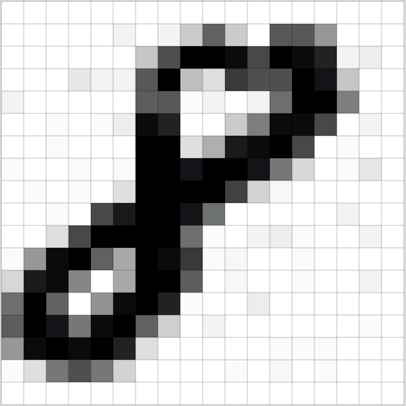

每个数字都作为神经网络的一个输入节点，然后就是用各种「8」和非「8」的图片来训练我们的神经网络了。理想的情况下，当我们喂给神经网络一个「8」的时候，我们会告诉它是「8」的概率是 100% ，而不是「8」的概率是 0%，反之亦然。

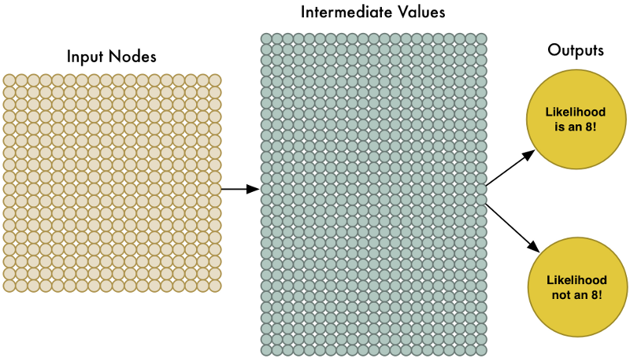

但是，实际的应用场景下，会有各种复杂的情况，比如：

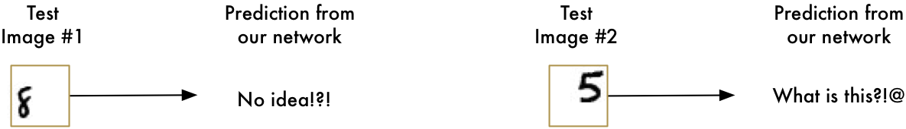

我们之前只训练了神经网络是识别"正常"图片中的数字，但实际上图片中数字有可能会出现位置偏移、扭曲变形、缩放、旋转等等各种情况。怎么办呢？

有两种比较暴力的解决方案：

- 滑框搜索(搜索过程如下图)
- 增加更多的训练数据，训练一个深度神经网络

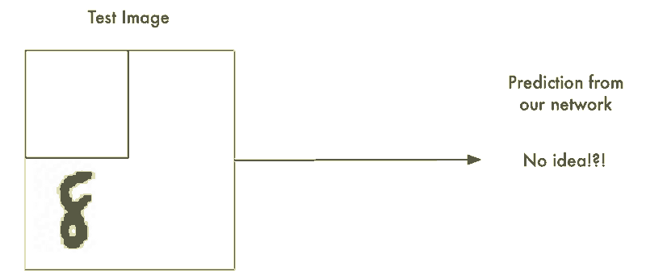

最终的解决方案：卷积神经网络

作为人类，你能够直观地感知到图片中存在某种层级（hierarchy）或者是概念结构（conceptual structure），比如，你能很快就能识别出这个图片的层级：

- 地面是由草和水泥组成的
- 图中有一个小孩
- 小孩在骑弹簧木马
- 弹簧木马在草地上

最重要的是，无论这个小孩所处的环境是怎样的，我们都能识别出小孩儿。当每一次出现不同的环境时，我们人类不需要重新学习小孩儿这个概念。

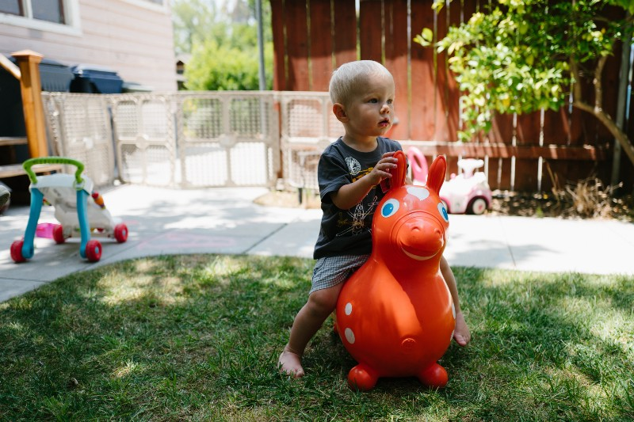

但是上面训练的神经网络做不到这些。它认为「8」出现在图片的不同位置，就是不一样的东西。它不能理解「物体出现在图片的不同位置还是同一个物体」这个概念。这意味着在每种可能出现的位置上，它必须重新学习识别各种物体。我们需要让我们的神经网络理解平移不变性（translation invariance）这个概念 —— 也就是说，无论「8」出现在图片的哪里，它都是「8」。

卷积神经网络是怎么做的呢？

1. 把图片分解成部分重合的小图块

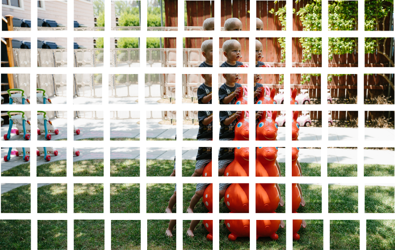

2. 把每个小图块输入到小型神经网络中

之前是把单张图片输入到神经网络中，来判断它是否一为「8」。这一次还做同样的事情，只不过我们输入的是一个个小图块：

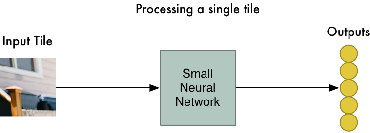

3. 把每一个小图块的结果都保存到一个新的数组当中

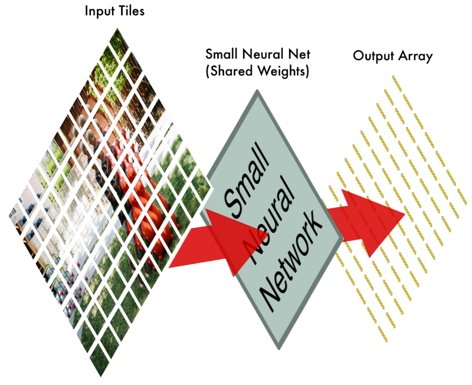

4. 缩减像素采样

为了减小这个数组的大小，我们利用一种叫做最大池化（max pooling）的函数来降采样（downsample）。

5. 作出预测

到现在为止，我们已经把一个很大的图片缩减到了一个相对较小的数组。数组就是一串数字而已，所以我们我们可以把这个数组输入到另外一个神经网络里面去。最后的这个神经网络会决定这个图片是否匹配。为了区分它和卷积的不同，我们把它称作「全连接」网络（“Fully Connected” Network）。

所以从开始到结束，我们的五步就像管道一样被连接了起来：

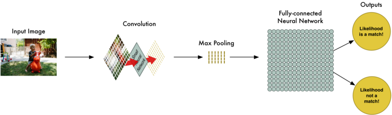

我们的图片处理管道是一系列的步骤：卷积、最大池化，还有最后的「全连接」网络。你可以把这些步骤任意组合、堆叠多次，来解决真实世界中的问题！你可以有两层、三层甚至十层卷积层。当你想要缩小你的数据大小时，你也随时可以调用最大池化函数。我们解决问题的基本方法，就是从一整个图片开始，一步一步逐渐地分解它，直到你找到了一个单一的结论。你的卷积层越多，你的网络就越能识别出复杂的特征。比如说，第一个卷积的步骤可能就是尝试去识别尖锐的东西，而第二个卷积步骤则是通过找到的尖锐物体来找鸟类的喙，最后一步是通过鸟喙来识别整只鸟，以此类推。

最后，本文的作者用 [CIFAR10](https://www.cs.toronto.edu/~kriz/cifar.html) 和 [Caltech-UCSD Birds-200-2011](http://www.vision.caltech.edu/visipedia/CUB-200-2011.html) 数据库的数据，基于 [TFLearn](http://tflearn.org/) 建立了一个鸟类分类器。具体的细节请"阅读原文"，获取带链接版本。

### [深度学习识别14类心律不齐准确率超人类专家](https://zhuanlan.zhihu.com/p/27757561)

吴恩达带领的斯坦福机器学习组(Stanford ML Group)最近开发了一种深度学习新算法，能诊断14类心律不齐，准确率可以媲美人类医生。

如果患者疑似有心律不齐症状，通常会去医院做个心电图。但是，在医院做的几分钟或者十几分钟心电图，往往发现不了问题，这时候医生就可能会给患者一个可穿戴的心电图监测器，要戴两周。两周，就要产生几百小时的心电图数据，医生要一秒一秒地检查，从中找出患者是否出现了有问题的心律不齐。更难的是，还得把有问题的心律不齐和安全无害的心律不齐区分开，它们在心电图上看起来非常像。

他们和可穿戴心电图监测设备厂商iRhythm合作，收集并标注了来自29163名患者的64121份心电图数据，以200 Hz的频率采样，构建了大规模的训练集和校验集，用来训练神经网络。随后，他们又从328名患者处收集了336份心电图数据，构成了测试集。数据集中的心电图样本每段30秒，都经过专业医生标注。测试集的数据标注则经过3名心脏病专家组成的委员会“会诊”得出。

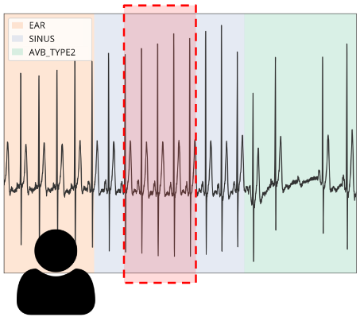

为识别心电图，他们构建了34层神经网络，包括33个卷积层、一个全连接层和softmax，以原始心电图时间序列为输入，每秒输出一次预测标签。

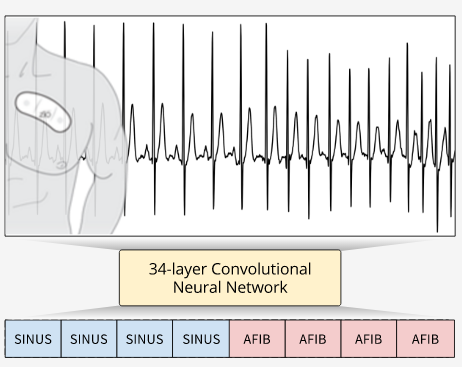

他们找了6名心脏病专家，分别从测试集的心电图中识别心律不齐，又以3名专家会诊的结果作为标准，将人类识别的结果、算法识别的结果与之进行比较。他们发现，算法的准确率与受过专业训练的人类心脏病专家相当，在很多情况下甚至比人类更好。

论文在[这里](https://arxiv.org/pdf/1707.01836.pdf), 项目主页在[这里](https://stanfordmlgroup.github.io/projects/ecg/)

### 参考资料
- https://medium.com/@ageitgey/machine-learning-is-fun-part-5-language-translation-with-deep-learning-and-the-magic-of-sequences-2ace0acca0aa
