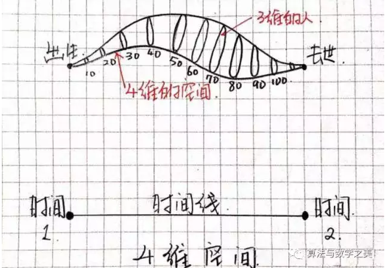
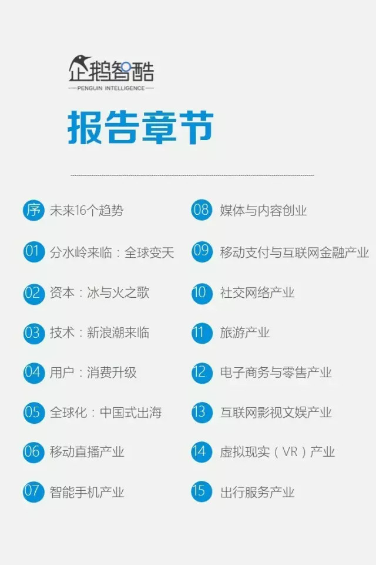

### [从零维到十维空间](http://mp.weixin.qq.com/s/kuBE03W2XT8OQN862Prarw)

作者用一支笔几张纸带着大家展开从零维空间到十维空间之旅，通俗地解释了虫洞、四维空间时间线弯曲、五维空间穿越等烧脑概念。

### [2017中国科技&互联网白皮书：解读未来5年16个趋势](https://36kr.com/p/5061678.html)

《企鹅智酷中国科技&互联网创新趋势白皮书（2017）》由腾讯科技•企鹅智酷发布。此次公开发布的版本共95页PPT，为8万字付费完整版白皮书的精简版本。

## 移动开发

### [聊聊移动端跨平台开发的各种技术](http://imweb.io/topic/5552c6f9cc7839da4c940459)

React Native 的出现让跨平台移动端开发这个话题火起来了，曾经大家以为在手机上可以像桌面那样通过 Web 技术来实现跨平台开发，却大多因为性能或功能问题而放弃，不得不针对不同平台开发多个版本。
但这并没有阻止人们对跨平台开发技术的探索，毕竟谁不想降低开发成本，一次编写就处处运行呢？除了 React Native，这几年还出现过许多其它解决方案，本文我将会对这些方案进行技术分析，供感兴趣的读者参考。
为了方便讨论，我将它们分为了以下 4 大流派：
- Web 流：也被称为 Hybrid 技术，它基于 Web 相关技术来实现界面及功能
- 代码转换流：将某个语言转成 Objective-C、Java 或 C#，然后使用不同平台下的官方工具来开发
- 编译流：将某个语言编译为二进制文件，生成动态库或打包成 apk/ipa/xap 文件
- 虚拟机流：通过将某个语言的虚拟机移植到不同平台上来运行

## 机器学习

### [Reading Wikipedia to Answer Open-Domain Questions](https://github.com/facebookresearch/DrQA)

Kaggle中的一个入门题，这篇文章手把手教你通过可视化分析数据集、特征工程、模型训练、模型融合等等，带你撸出一个baseline的模型，然后一步一步优化。

