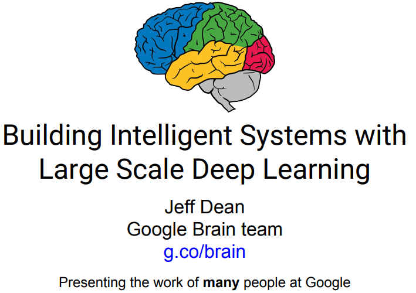

### [从零维到十维空间](http://mp.weixin.qq.com/s/kuBE03W2XT8OQN862Prarw)

作者用一支笔几张纸带着大家展开从零维空间到十维空间之旅，通俗地解释了虫洞、四维空间时间线弯曲、五维空间穿越等烧脑概念。

### [2017中国科技&互联网白皮书：解读未来5年16个趋势](https://36kr.com/p/5061678.html)

《企鹅智酷中国科技&互联网创新趋势白皮书（2017）》由腾讯科技•企鹅智酷发布。此次公开发布的版本共95页PPT，为8万字付费完整版白皮书的精简版本。

## 移动开发

### [聊聊移动端跨平台开发的各种技术](http://imweb.io/topic/5552c6f9cc7839da4c940459)

React Native 的出现让跨平台移动端开发这个话题火起来了，曾经大家以为在手机上可以像桌面那样通过 Web 技术来实现跨平台开发，却大多因为性能或功能问题而放弃，不得不针对不同平台开发多个版本。
但这并没有阻止人们对跨平台开发技术的探索，毕竟谁不想降低开发成本，一次编写就处处运行呢？除了 React Native，这几年还出现过许多其它解决方案，本文我将会对这些方案进行技术分析，供感兴趣的读者参考。
为了方便讨论，我将它们分为了以下 4 大流派：
- Web 流：也被称为 Hybrid 技术，它基于 Web 相关技术来实现界面及功能
- 代码转换流：将某个语言转成 Objective-C、Java 或 C#，然后使用不同平台下的官方工具来开发
- 编译流：将某个语言编译为二进制文件，生成动态库或打包成 apk/ipa/xap 文件
- 虚拟机流：通过将某个语言的虚拟机移植到不同平台上来运行

### [VasSonic轻量级的高性能的Hybrid框架正式开源](http://mp.weixin.qq.com/s/yqMq8AdnmA_ZxxSvHfF-dg)

VasSonic取名于索尼动画形象音速小子，是腾讯QQ会员 VAS团队研发的一个轻量级的高性能的Hybrid框架，专注于提升页面首屏加载速度，完美支持静态直出页面和动态直出页面，兼容离线包等方案。目前QQ会员、QQ购物、QQ钱包、企鹅电竞等业务已经在使用，平均日均PV在1.2亿以上，并且这个数字还在快速增长。

接入VasSonic后首次打开可以在初始化APP的时候并行请求页面资源，并且具备边加载边渲染的能力。非首次打开时，APP可以快速加载上次打开动态缓存在本地的页面资源，然后动态刷新页面。腾讯手机QQ通过VasSonic框架使得页面首屏耗时平均低于1S以下。

项目地址在[这里](https://github.com/Tencent/vassonic), 腾讯的工程师之前也分享过这个方案：[QQ移动页面框架优化实践](http://ppt.geekbang.org/slide/show/862)

## 机器学习

### [谷歌传奇Jeff Dean给创业者的一小时AI讲座 | 86页PPT+视频](http://mp.weixin.qq.com/s/Qz4NoX5VEjgCVryHAIWBFw)

传奇一般的Jeff Dean现在领导着Google Brain团队，也是Google研发群组的高级研究员（Senior Fellow）。近日，Jeff Dean为YC AI小组的同学讲了一堂时长近1小时的课程，讲述了目前Google目前在人工智能方面的研究和进展。

PPT在[这里](https://pan.baidu.com/s/1pLC1aaR)

### [The Google Brain team — Looking Back on 2016](https://research.googleblog.com/2017/01/the-google-brain-team-looking-back-on.html)

Google Brain team 2016年的工作回顾，这篇文章从论文发表、自然语言理解、机器人、医疗健康等等角度介绍了Brain团队在过去一年的工作成果。