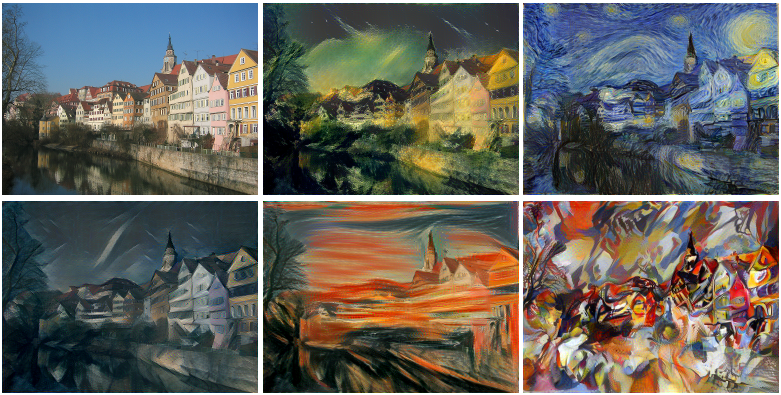
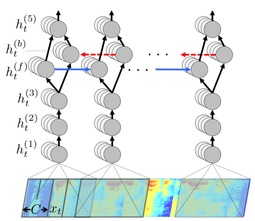
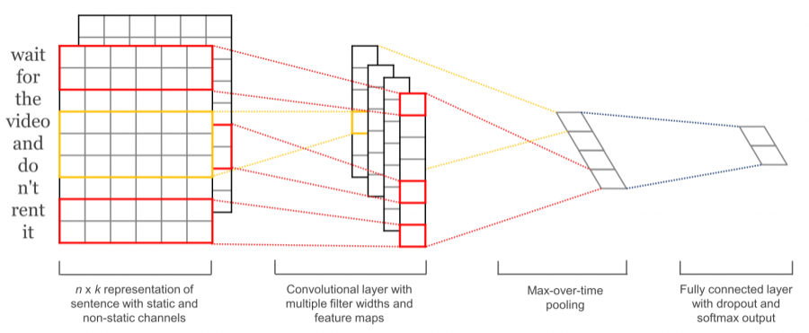
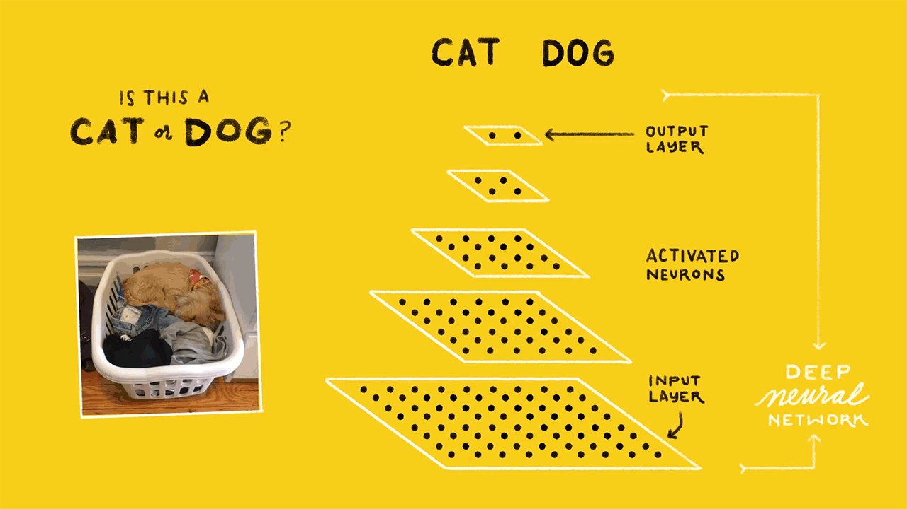
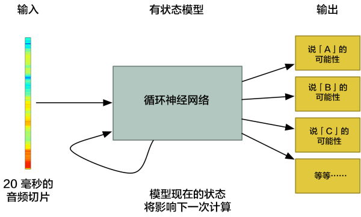

## 机器学习

### [深度学习动手入门：GitHub上四个超棒的TensorFlow开源项目](http://mp.weixin.qq.com/s/AIKHJSXL3KsgqSsqu6Wy1g)

TensorFlow是一个深度学习库，使用这一框架，可以用来构建和测试深度神经网络。深度学习让我们能够以极高的准确性构建复杂的应用程序。图像、视频、文本、音频等领域的问题，都可以通过深度学习解决。TensorFlow可以用于实现前述所有应用。

下面分享几个四个非常有意思的TensorFlow GitHub项目。

#### 项目一：[Neural Style](https://github.com/cysmith/neural-style-tf)

这是最酷的TensorFlow GitHub项目之一。神经风格是将一张照片的风格迁移到另一张照片上的过程，同时保留相关的特张。简单的来说，通过这个项目，你可以使用TensorFlow创建自己的Prisma应用程序。

#### 项目二：[Mozilla Deep Speech](https://github.com/mozilla/DeepSpeech)

这个GitHub项目使用TensorFlow将语音转换为文本。语音转文本是一个热门的机器学习领域，然而各地的人们有着不同的口音，这也是一个难以解决的问题。不过仍然可以通过深度学习实现非常不错的准确性。

其实这个项目，是一个基于百度DeepSpeech架构的TensorFlow实现。换句话说，这个项目是百度的内核，Google的外貌。

#### 项目三：[句子分类](https://github.com/dennybritz/cnn-text-classification-tf)

句子分类就是识别句子类型的过程。例如，对于“食物非常糟糕”这个句子，你可能希望将其分类为正面句子或负面句子，这也被称为情绪分析。这个问题的难点在于：句子结构带来的复杂性。

利用卷积神经网络，我们可以尝试构建一个强大的文本分类器。

#### 项目四：[图像分类/物体识别](https://github.com/akshaypai/tfClassifier)

图像分类，也就是训练系统识别猫猫狗狗，或者车道、海滩、天际线等场景。计算机视觉是一个范围巨大的领域，从面部识别到情感识别，甚至可以进行视觉气体泄漏检测。虽然实现流程各异，但底层系统是相通的。

所以作者创建了一个TensorFlow GitHub库，其中包括两个相互关联的部分。第一部分：能够识别1000个对象的TensorFlow图像分类器。第二部分：创建并训练一个全新的图像分类器。

### [如何用深度学习进行语音识别？](https://medium.com/@ageitgey/machine-learning-is-fun-part-6-how-to-do-speech-recognition-with-deep-learning-28293c162f7a)

语音识别明明已经出现几十年了，为何直到现在才成为主流呢？那是因为深度学习终于将语音识别在非受控环境下的准确度提高到了一个足以投入实用的程度。本文介绍了如何用深度学习进行语音识别：包括声波信号采样、声音数据预处理、通过傅里叶变换把复杂声波分解为简单的声波、然后从短声音识别字符。

