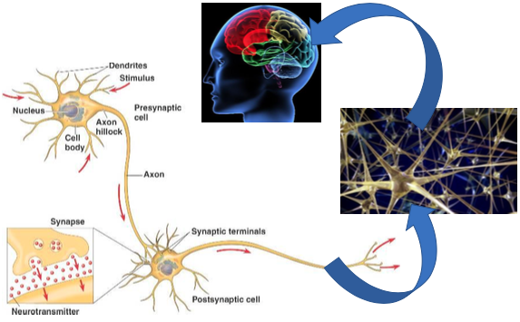
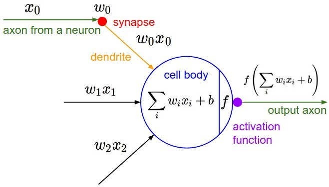
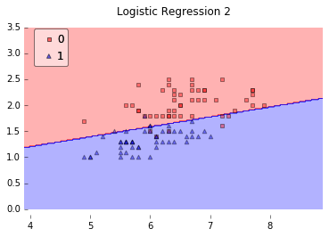
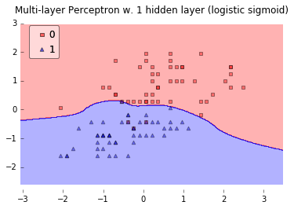
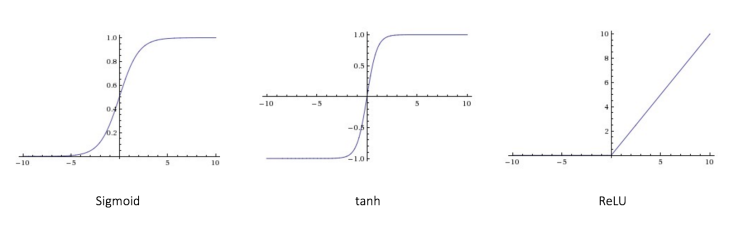
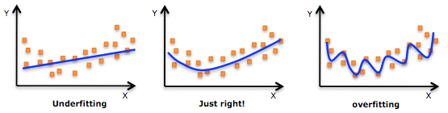
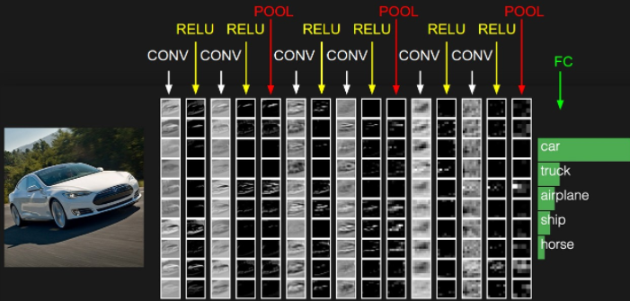

深度学习最近非常火爆，各种介绍深度学习的文章层出不穷。作为一个入门小白，看到各种概念和名词后难免会望而却步，这篇文章盘点罗列了一下深度学习中比较重要的概念和常见的名词。

### 深度学习

深度学习是机器学习研究中的一个新的领域，其动机在于建立、模拟人脑进行分析学习的神经网络，它模仿人脑的机制来解释数据，例如图像，声音和文本。

### 人工神经网络

人工神经网络（英文：artificial neural network，缩写ANN），简称神经网络（英文：neural network，缩写NN），是一种模仿生物神经网络(动物的中枢神经系统，特别是大脑)的结构和功能的数学模型或计算模型，用于对函数进行估计或近似。神经网络是由大量彼此相连、概念化的人造神经元组成的，这些神经元彼此之间传递着数据，相应的权重也会随着神经网络的经历而进行调整。神经元们有着激活的阈值，当它们遇到相应的数据以及权重时会被激活，这些被激活的神经元组合起来导致了“学习”行为的产生。

### 神经元

神经元（英语：neuron），又名神经原或神经细胞（英语：nerve cell），是神经系统的结构与功能单位之一。神经元能感知环境的变化，再将信息传递给其他的神经元，并指令集体做出反应。神经元基本构造由树突、轴突、髓鞘、细胞核组成。传递形成电流，在其尾端为受体，借由化学物质(化学递质）传导(多巴胺、乙酰胆碱)，在适当的量传递后在两个突触间形成电流传导，如下图所示：

### 感知器

为了模拟生物神经元的特性，1957年就职于Cornell航空实验室的美国心理学家Frank Rosenblatt构造出了一种简化的数学模型——感知机，如下图所示：

它以一组二进制作为输入值(类似当前神经元之前的神经元传递过来的信号)，x0x0作为偏置项始终为1，然后将每个输入值乘以一个权重后求和（类似每个神经元传递过来的信号强度），如果最终的结果大于设定的阈值，就输出1，否则输出0（类似于神经元进行信息处理后是否放电）

### 前馈神经网络

前馈神经网络是一种最简单的神经网络，各神经元分层排列。每个神经元只与前一层的神经元相连。接收前一层的输出，并输出给下一层．各层间没有反馈。

前馈神经网络采用一种单向多层结构。其中每一层包含若干个神经元，同一层的神经元之间没有互相连接，层间信息的传送只沿一个方向进行。其中第一层称为输入层。最后一层为输出层．中间为隐含层，简称隐层。隐层可以是一层，也可以是多层。

### 激活函数

在神经网络中，激活函数的作用是能够给神经网络加入一些非线性因素，使得神经网络可以更好地解决较为复杂的问题。

举个例子，如下图，在最简单的情况下，数据是线性可分的，只需要一条直线就已经能够对样本进行很好地分类。

但如果情况变得复杂了一点，数据就变成了线性不可分的情况。在这种情况下，简单的一条直线就已经不能够对样本进行很好地分类了。

于是需要引入一些非线性的因素，来更好地解决复杂的问题。而激活函数恰好就是那个能够帮助我们引入非线性因素的存在，使得神经网络能够更好地解决较为复杂的问题。

常见的激活函数有：
- Sigmoid（S 型激活函数）：输入一个实值，输出一个 0 至 1 间的值 σ(x) = 1 / (1 + exp(−x))
- tanh（双曲正切函数）：输入一个实值，输出一个 [-1,1] 间的值 tanh(x) = 2σ(2x) − 1
- ReLU：ReLU 代表修正线性单元。输出一个实值，并设定 0 的阈值（函数会将负值变为零）f(x) = max(0, x)

### 权重(Weights)、偏置(Bias)、损失函数(Loss Function)

当输入信号进入到神经元后，会被乘以相应的权重因子。举例来说，假设一个神经元有两个输入信号，那么每个输入将会存在着一个与之相应的权重因子。在初始化网络的时候，这些权重会被随机设置，然后在训练模型的过程中再不断地发生更改。在经过训练后的神经网络中，一个输入具有的权重因子越高，往往意味着它的重要性更高，对输出的影响越大。另一方面，当权重因子为0时意味着这个输入是无价值的。

除了权重之外，输入还需要经过另外一种线性处理，叫做偏置。通过把偏置b与加权后的输入信号a*W1直接相加，以此作为激活函数的输入信号。

神经网络的训练过程本质上其实就是为当前模型找到合理的权重、偏置等参数，那么什么样的值才算是合理呢？损失函数就是用来描述这个合理性的，神经网络训练过程就是最小化这个损失函数的过程。

### 过拟合与正则

在机器学习中，过拟合现象是普遍存在的。所谓过拟合就是模型过分拟合了每个数据点，导致模型变得比较复杂，在测试数据集上的泛化性较差。下面的这张图会更能直观感受：

防止过拟合的方式有很多，一般来说可以加正则，early-stopping，dropout等。加正则可能是最广泛的一种方式。

### 反向传播算法

神经网络刚开始训练的时候，所有参数都是随机的，通过训练数据集不断地更新、调整参数。这个训练过程的具体方法就是反向传播算法。反向传播可分为四部分，分别是前向传导、损失函数、后向传导，以及权重更新。

### 卷积神经网络

传统的神经网络都是采用全连接的方式，即输入层到隐藏层的神经元都是全部连接的，这样做将导致参数量巨大，使得网络训练耗时甚至难以训练。卷积神经网络受到现代生物神经网络相关研究的启发，它的权值共享网络结构使之更类似于生物神经网络，降低了网络模型的复杂度，减少了权值的数量，已成为当前语音分析和图像识别领域的研究热点。

一个典型的卷积神经网络是这样的：输入→卷积→ReLU→卷积→ReLU→池化→ReLU→卷积→ReLU→池化→全连接

### 参考资料
- https://zh.wikipedia.org/wiki/%E6%B7%B1%E5%BA%A6%E5%AD%A6%E4%B9%A0
- http://www.moonshile.com/post/juan-ji-shen-jing-wang-luo-quan-mian-jie-xi#toc_0
- http://www.jeyzhang.com/cnn-learning-notes-1.html
- http://hpzhao.com/2017/03/29/%E6%9C%BA%E5%99%A8%E5%AD%A6%E4%B9%A0%E4%B8%AD%E7%9A%84%E6%AD%A3%E5%88%99%E5%8C%96/